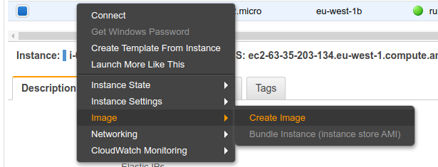
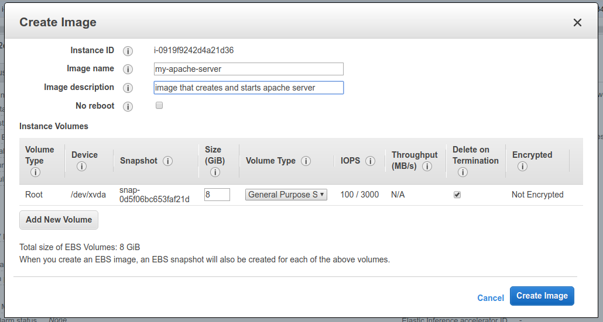
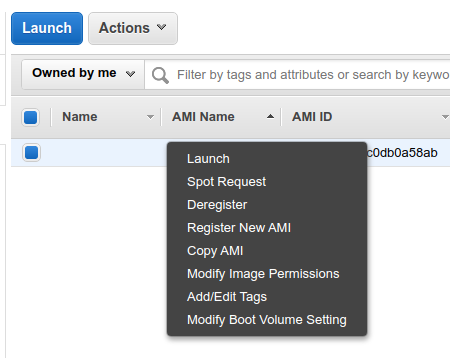
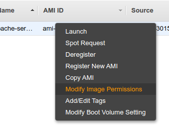
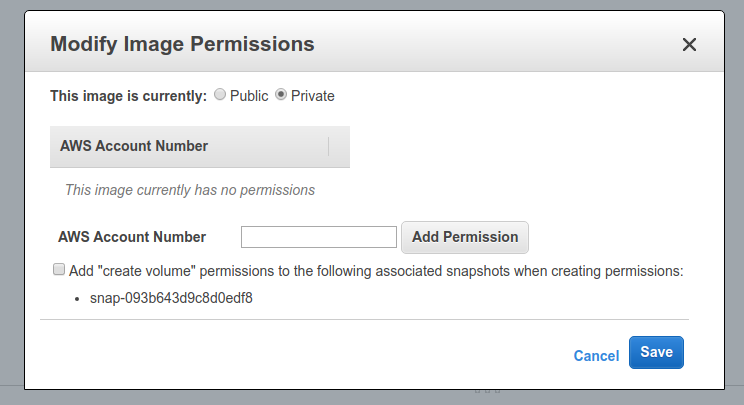

# EC2 AMIs

As we previously saw, AWS comes with base images such as:
- Ubuntu
- Fedora
- RedHat
- Windows
- etc

These images can be customised at runtime using `EC2 User Data`.

But, you can create your own image, which can be done with an `AMI`.

Using custom built AMI can provide with following advantages:
- Pre-installed packages needed
- Faster boot time (no need for ec2 user data at boot time)
- Machine comes configured with monitoring / enterprise software
- Security concerns - control over the machines in the network
- Control of maintenance and updates of AMIs over time
- Active Directory Integration out of the box
- Installing your app ahead of time (for faster deploys when auto-scaling)
- Using someone else's AMI that is optimised for running an app, DB, etc..

**AMI are built for a specific AWS region!**

Using public AMIs
- You can leverage AMIs from other people
- You can also pay for other people's AMI by the hour
    - These people have optimised the software
    - The machine is easy to run and configure
    - You basically rent "expertise"'from the AMI creator
- AMI can be found and published on the Amazon Marketplace

**Warning**
- Do not use an AMI you don't trust
- Some AMIs might come with malware or may not be secure for your enterprise

AMI Storage
- Your AMI take space and they live in Amazon S3
- Amazon S3 is a durable, cheap and resilient storage where most of your backups will live (but you won't see them in the S3 console)
- By default your AMIs are private and locked for your account / region
- You can also make your AMIs public and share them with other AWS accounts or sell them on the AMI Marketplace

AMI Pricing
- AMIs live in Amazon S3, so you get charged for the actual space it takes in Amazon S3
- Overall, it is quite inexpensive to store private AMIs
- Make sure to remove the AMIs you don't use

## Hands on

We are going to use a fresh EC2 instance and ssh into it.


```bash
➜  notes git:(master) ✗ ssh -i ~/Downloads/EC2Tutorial.pem ec2-user@63.35.203.134
The authenticity of host '63.35.203.134 (63.35.203.134)' can't be established.
ECDSA key fingerprint is SHA256:IRLAu1mhR88VLPx7js5V1kxaFHlg6TtNNVDSWpZKz5c.
Are you sure you want to continue connecting (yes/no/[fingerprint])? yes
Warning: Permanently added '63.35.203.134' (ECDSA) to the list of known hosts.

       __|  __|_  )
       _|  (     /   Amazon Linux 2 AMI
      ___|\___|___|

https://aws.amazon.com/amazon-linux-2/
5 package(s) needed for security, out of 13 available
Run "sudo yum update" to apply all updates.
[ec2-user@ip-172-31-34-217 ~]$ 
[ec2-user@ip-172-31-34-217 ~]$ sudo su
[root@ip-172-31-34-217 ec2-user]# yum update -y
[root@ip-172-31-34-217 ec2-user]# yum install -y httpd
[root@ip-172-31-34-217 ec2-user]# systemctl enable httpd
Created symlink from /etc/systemd/system/multi-user.target.wants/httpd.service to /usr/lib/systemd/system/httpd.service.
[root@ip-172-31-34-217 ec2-user]# systemctl start httpd
[root@ip-172-31-34-217 ec2-user]# echo "Hello World $(hostname -f)" > /var/www/html/index.html
[root@ip-172-31-34-217 ec2-user]# curl localhost:80
Hello World ip-172-31-34-217.eu-west-1.compute.internal
```

Visit the public IP from a browser:


Now we can create an image from the instance by doing the following:






Now we can go to AMIs section and see the image.


When it's complete, we can do multiple things with it:




We'll click on launch and it will take us through a new instance creation process.


Once it's online, we can visit it in browser:


## Cross Account AMI Copy

https://docs.aws.amazon.com/AWSEC2/latest/UserGuide/CopyingAMIs.html

- You can share an AMI with another AWS account
- Sharing an AMI does not affect the ownership of the AMI
- If you copy an AMI that has been shared with your account, you are the owner of the target AMI in your account.
- You copy an AMI that was shared with you from another account, the owner of the source AMI must grant you read permissions for the storage that backs the AMI, either associated EBS snapshot (for an Amazon EBS-backed AMI) or an associated S3 bucket (for an instance store-backed AMI).
- Limits:
    - You can't copy an encrypted AMI that was shared with you from another account. Instead, if the underlying snapshot and encryption key were shared with you, you can copy the snapshot while re-encrypting it with a key of your own. You own the copied snapshot and can register it as a new AMI.
    - You can't copy an AMI with an associated billingProduct code that was shared with you from another account. This includes Windows AMIs and AMIs from the AWS marketplace. To copy a shared AMI with a billingProduct code, launch an EC2 instance in your account using the shared AMI and then create an AMI from the instance.

In order to share an AMI, you right click on it and select `Modify Image Permissions`.



