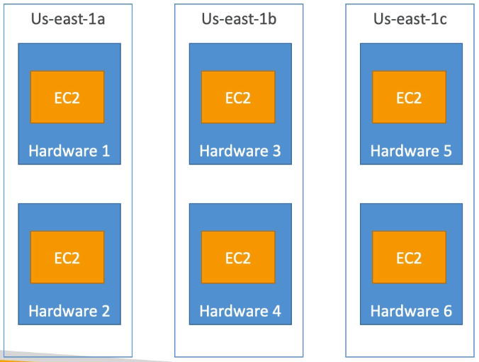
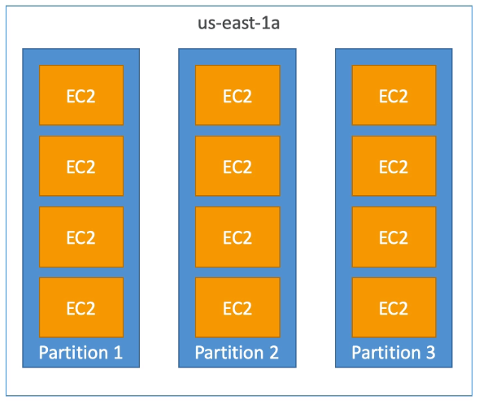
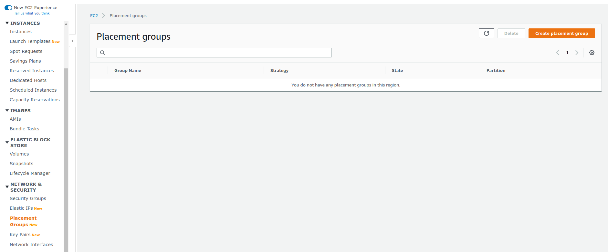

# EC2 Placement Groups

- Sometimes you want control over the EC2 Instance placement strategy
- That strategy can be defined using placement groups
- When you create a placement group, you specify one of the following strategies for the group
    - Cluster - cliusters instances into a low-latency group in a single availability zone
    - Spread - spreads instances accross underlying hardware (max 7 instances per group per AZ) - critical applications
    - Partition - spreads instances accross many different paritions (which rely on sets of racks) within an AZ. Scales to 100s of EC2 instances per group (Hadoop, Cassandra, Kafka)

## Cluster

Pros:
- Great network (10gbps bendwith between instances)
Cons:
- If the rack fails, all instances failes at the same time
Use case:
- Bid Data job that needs to complete fast
- Application that needs extremely low latency and high network throughput

## Spread

Pros:
- Can span across Availability Zones (AZ)
- Reduced risk of simulataneous failure
- EC2 Instances are on different physical hardware

Cons:
- Limited to 7 instances per AZ per placement group

Use case:
- Application that needs to maximize high availability
- Critical Applications where each instance must be isolated from failure from each other

## Partition

- Up to 7 partitions per AZ
- Up to 100s of EC2 instances
- The instances in a partition do not share racks with the instances in other paritions
- A partition failure can affect many EC2 but won't affect other partitions
- EC2 instances get access to the parition information as metadata

Use cases:
- HDFS
- HBase
- Cassandra
- Kafka

## Usage

You can find these options under `Network & Security -> Placement Groups`.

Now, when creating a new instance, we can specify a placement group.

