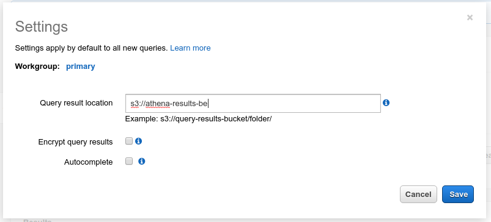

# Athena Hands on

We can access `Athena` from AWS Console.


When clicking on `Get Started` it redirects us to a Query Editor.


Since it asked me to setup results path, I created a new S3 bucket.



Then ran following queries:

```sql
CREATE database s3_access_logs_db;
```

Select the created database and run this query:

```sql
CREATE EXTERNAL TABLE IF NOT EXISTS s3_access_logs_db.mybucket_logs(
    BucketOwner STRING,
    Bucket STRING,
    RequestDateTime STRING,
    RemoteIP STRING,
    Requester STRING,
    RequestID STRING,
    Operation STRING,
    Key STRING,
    RequestURI_operation STRING,
    RequestURI_key STRING,
    RequestURI_httpProtoversion STRING,
    HTTPstatus STRING,
    ErrorCode STRING,
    BytesSent BIGINT,
    ObjectSize BIGINT,
    TotalTime STRING,
    TurnAroundTime STRING,
    Referrer STRING,
    UserAgent STRING,
    VersionId STRING)
ROW FORMAT SERDE 'org.apache.hadoop.hive.serde2.RegexSerDe'
WITH SERDEPROPERTIES (
    'serialization.format' = '1',
    'intput.regex' = '([^ ]*) ([^ ]*) \\[(.*?)\\] ([^ ]*) ([^ ]*) ([^ ]*) ([^ ]*) ([^ ]*) \\\"([^ ]*) ([^ ]*) (- |[^ ]*)\\\" (-|[0-9]*) ([^ ]*) ([^ ]*) ([^ ]*) ([^ ]*) ([^ ]*) ([^ ]*) (\"[^\"]*\") (^ ]*)$'
) LOCATION 's3://cf-access-logs-be/';
```

Then we can run queries against our log files like:

```sql
SELECT *
FROM "s3_access_logs_db"."mybucket_logs"
WHERE httpStatus='403';
```

```sql
SELECT requesturi_operation, httpstatus, count(*)
FROM "s3_access_logs_db"."mybucket_logs"
GROUP BY requesturi_operation, httpstatus;
```

Cleanup

```sql
DROP DATABASE s3_access_logs_db;
```