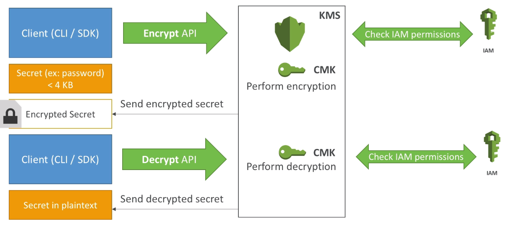

# AWS KMS (Key Management Service)

- Anytime you hear "encryption" for an AWS service, it's most likely KMS
- Easy way to control access to your data, AWS manages keys for us
- Fulle integrated with IAM for authorization
- Seamlessly integrated into:
    - Amazon EBS: encrypt volumes
    - Amazon S3: Server side encryption of objects
    - Amazon Redshift: encryption of data
    - Amazon RDS: encryption of data
    - Amazon SSM: Parameter store
    - etc
- But you can also use the CLI/ SDK

## AWS KMS 101

- Anytime you need to share sensitive information - use KMS
    - Database passwords
    - Credentials to external service
    - Private key of ssl certificates
- The value in kms is that the CMK used to encrypt data can never be retrieved by the user, and the CMK can be rotated for extra security
- Never ever store your secrets in plaintext, especially in your code!
- Encrypted secrets can be stored in the code / environment variables
- KMS can only help in encrypting up to 4KB of data per call
- IF data > 4 KB, use envelope encryption
- To give access to KMS to someone:
    - Make sure Key Policy allows the user
    - Mak sure IAM policy allows the API Calls

## AWS KMS (Key Management Service)

- Able to fully manage the keys & policies
    - Create
    - Rotation policies
    - Disable
    - Enable
- Able to audit key usage (using CloudTrail)
- Three types of Customer Master Keys (CMK)
    - AWS Managed Service Default CMK: free
    - User Keys created in KMS: $1 / month
    - User Keys imported (must be 256-bit symmetric key): $1/month
- + pay for API call to KMS ($0.03/ 10000 calls)

## API - Encrypt and Decrypt

## Encryption in AWS Services

- Requires migration (though Snapshot / Backup)
    - EBS Volumes
    - RDS databases
    - ElastiCache
    - EFS network file system
- In-place encryption
    - S3