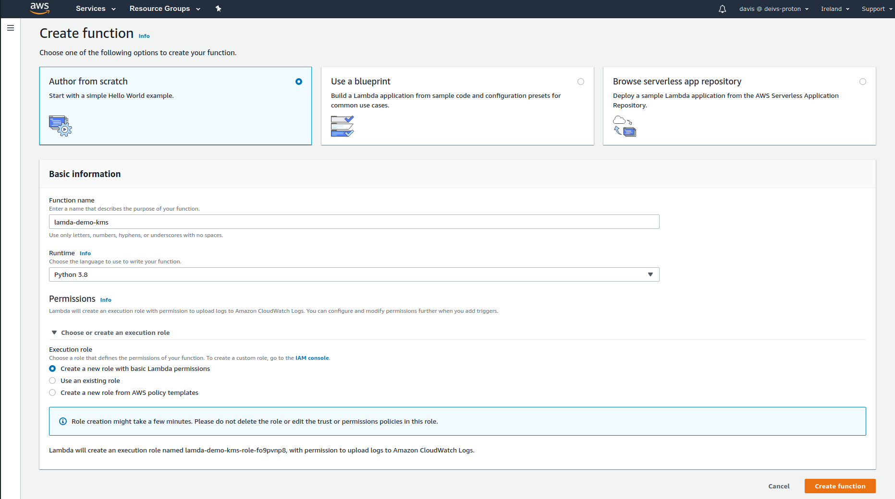
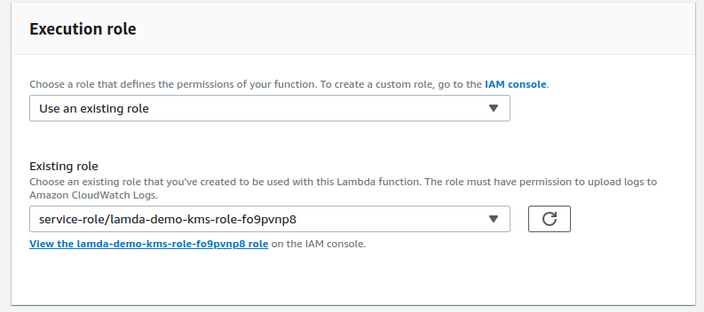
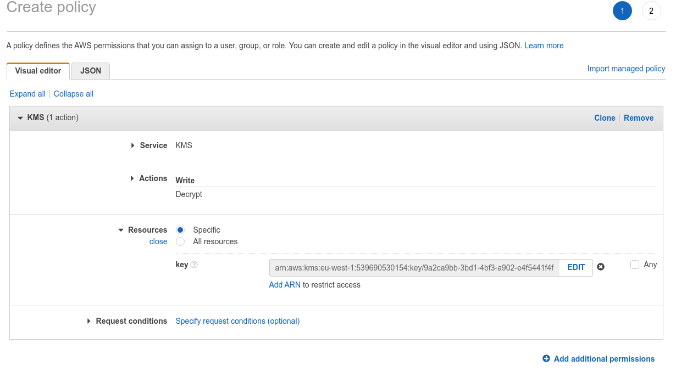
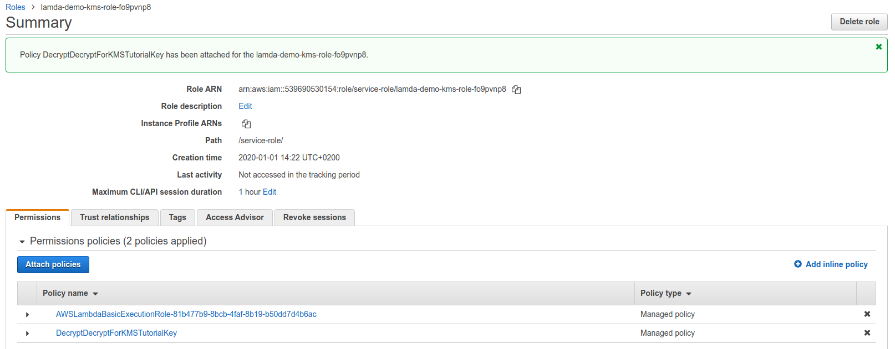
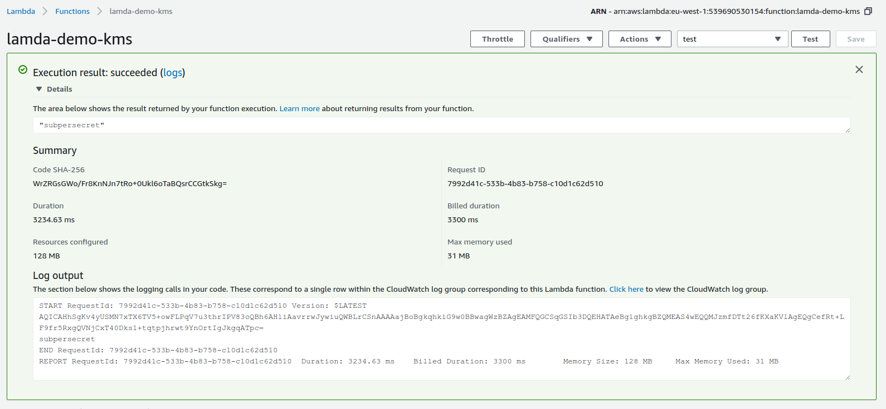

# KMS And Lamda practice

## KMS

In KMS we have a `AWS Managed keys` section available that stores keys for aws managed services that we have had enabled encryption.


You can also go to `Customer managed keys` and create your own keys.


When created a key, we can also open it up and enable key rotation:


## Lamda

We are going to create a new lambda function.



Now, if we wanted to use database password, this is bad:

```python
import json
dbpassword = "supersecret"

def lambda_handler(event, context):
    return dbpassword
```

We can leverage environment variables though, but it is still not perfect, because if someone accesses the lamda UI, the password is still visible.

We can leverage the encryption option with the previously created `Customer managed key` though.


Now if we change the code to run this:

```python
import boto3
import os

from base64 import b64decode

ENCRYPTED = os.environ['DB_PASSWORD']
# Decrypt code should run once and variables stored outside of the function
# handler so that these are decrypted once per container
DECRYPTED = boto3.client('kms').decrypt(CiphertextBlob=b64decode(ENCRYPTED))['Plaintext'].decode('utf-8')

def lambda_handler(event, context):
    print(ENCRYPTED)
    print(DECRYPTED)
    return DECRYPTED
```

When testing, we will get an error:

```
An error occurred (AccessDeniedException) when calling the Decrypt operation: The ciphertext refers to a customer master key that does not exist, does not exist in this region, or you are not allowed to access.
```

This is because our lamda function does not have the permission to decrypt it.

We are going to open up a new tab with the `View the lamda-demo-kms-role-fo9pvnp8 role`.



Then create and attach a policy.






Test it once more:



If we view the logs, we can see the both prints of the encrypted and decrypted versions:

