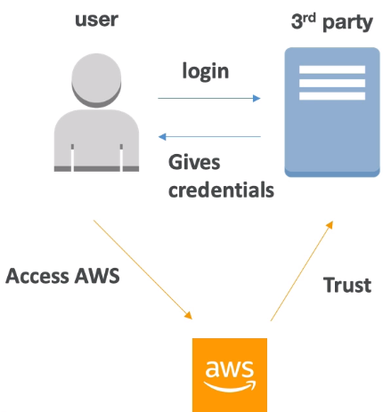
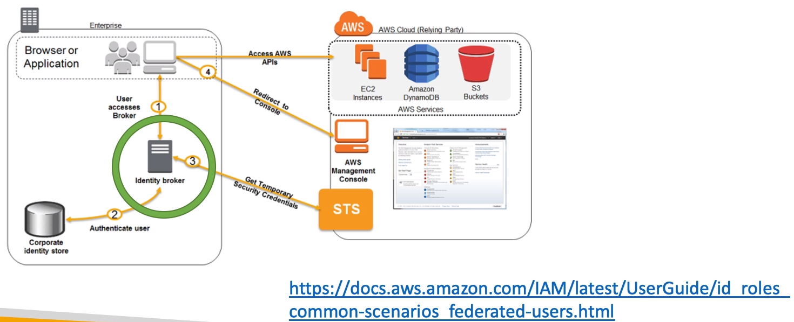
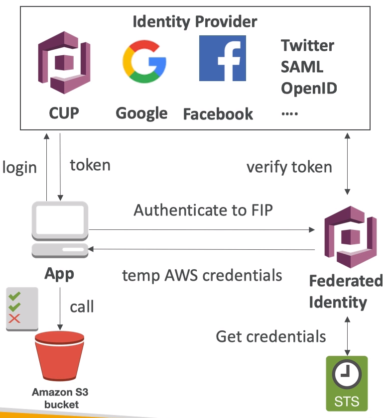

# Identity Federation With SAML and Cognito

## What's Identity Federation?

- Federation lets users outside of AWS to assume temporary role for accessing AWS resources.
- These users assume identity provided access role.
- Federation assumes a form of 3rd part authentication:
    - LDAP
    - Microsoft Active Directory (~=SAML)
    - Single Sign On
    - Open ID
    - Cognito
- Using federation, you don't need to create IAM users (user management is outside of AWS)

## SAML Federation (For enterprises)

- To integrate Active Directory / ADFS with AWS (or any SAML 2.0)
- Provides access to AWS Console or CLI (though temporary creds)
- No need to create an IAM user for each of your employees

## Custom Identity Broker Application (For Enterprises)

- Use only if identity provider is not compatible with SAML 2.0
- The identity broker must determine the appropriate IAM policy

## AWS Cognito - Federate Identity Pools (For Public Applications)

- Goal:
    - Provide direct access to AWS Resources from the Client Side
- How:
    - Log in to federated identity provider - or remain anonymous
    - Get temporary AWS credentials back from the Federated Identity Pool
    - These credentials come with a pre-defined IAM policy stating their permissions
- Example
    - provide (temporary) access to write to S3 bucket using Facbook Login
- Note
    - Web Identity Federation is an alternative to using Cognito but AWS recommends against it.

