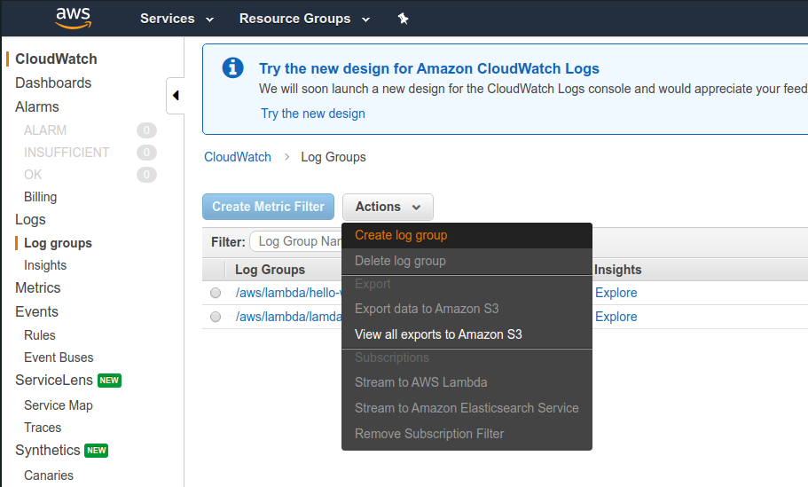

# VPC Flow Logs + Athena

- Capture information about IP traffic going into your interfaces
    - VPC Flow Logs
    - Subnet Flow Logs
    - Elastic network Interface Flow Logs
- Helps to monitor & troubleshoot connectivity issues
- Flow logs data can go to S3 / CloudWatch Logs
- Captures network information from AWS managed interfaces too: ELB, RDS, ElastiCache, Redshift, WorkSpaces.

## Flow Log Syntax

- <version> <account-id> <interface-id> <srcaddr> <dstaddr> <srcport> <dstport> <protocol> <packets> <bytes> <start> <end> <action> <log-status>
- srcaddr, dstaddr help identify problematic IP
- srcport, dstport help identify problematic ports
- Action: success of failure of the request due to Security Group / NACL
- Can be used for analytics on usage patterns or malicious behaviour
- Flow logs example [https://docs.aws.amazon.com/vpc/latest/userguide/flow-logs.html#flow-log-records](https://docs.aws.amazon.com/vpc/latest/userguide/flow-logs.html#flow-log-records)
- Query VPC flow logs using Athena on S3 or CloudWatch Logs Insights

Now we can use the documentation at [https://docs.aws.amazon.com/athena/latest/ug/vpc-flow-logs.html](https://docs.aws.amazon.com/athena/latest/ug/vpc-flow-logs.html) to analyze the flow logs with Athena.

