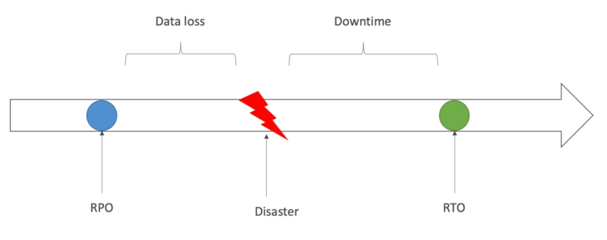
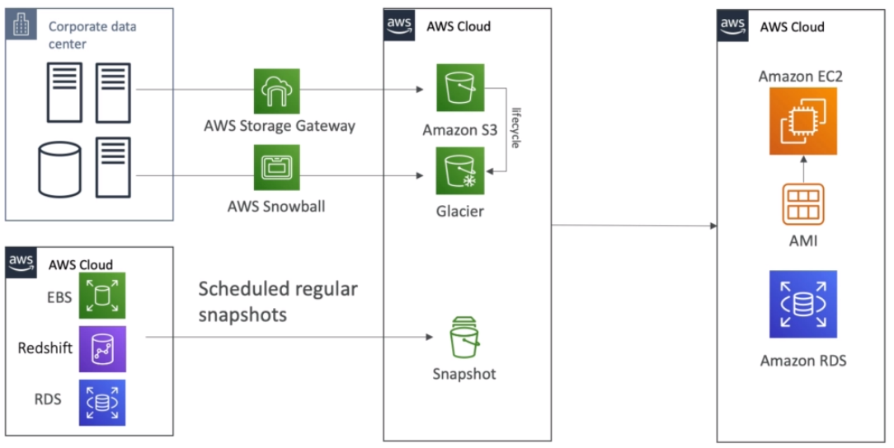
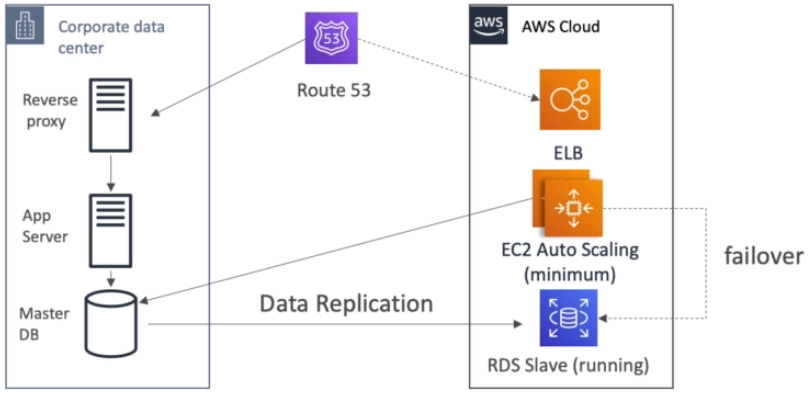
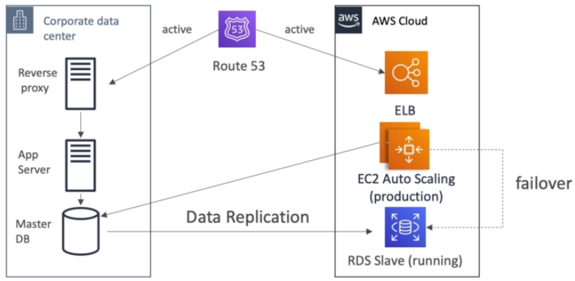

# Disaster Recovery

- Any event that has a negative impact on a company's business continuity or finances is a disaster
- Disaster recovery (DR) is abount preparing for and recovering from a disaster
- What kind of disaster recovery?
    - On-premise => On-premise: traditional DR, and very expensive
    - On-premise => Aws Cloud: hybrid recovery
    - AWS CLoud Region A => AWS Cloud Region B
- Need to define two terms:
    - RPO : Recovery Point Objective
    - RTO : Recovery Time Objective

## RPO and RTO

## Disaster Recovery Strategies

- Backup and Restore
- Pilot Light
- Warm Standby
- Hot Site / Multi Site Approach

## Backup and Restore (High RPO)

## Disaster Recovery - Pilot Light

- A small version of the app is always running in the cloud
- Useful for the critical core (pilot light)
- Very similar to backup and restore
- Faster than backup and restore as critical systems are already up

## Warm Standby

- Full system is up and running, but at minimum size
- Upon disaster, we can scale to production load

## Multi Site / Hot Site Approach

- Very low RTO (minutes or seconds) - very expensive
- Full Production Scale is running AWS and On Premise

## All AWS Multi Region

## Disaster Recovery Tips

- Backup
    - EBS Snapshots, RDS automated backups / Snapshots etc
    - Regular pushes to S3 / S3 IA / Glacier, Lifecycle Policy, Cross Region Replication
    - From on-premise: Snowball or Storage Gateway
- High Availability
    - Use Route53 to migrate DNS over from Region to Region
    - Rds Multi-AZ, ElastiCache Multi-AZ, EFS, S3
    - Site to Site VPON as a recovery from Direct Connect
- Replication
    - RDS Replication (Cross Region), AWS Aurora + Global Databases
    - Database replication from on-premise to RDS
    - Storage Gateway
- Automation
    - CloudFormation / Elastic Beanstalk to re-create a whole new environment
    - Recover / Reboot EC2 isntances with CLoudWatch if alarms fail
    - AWS Lamda functions for customized automations
- Chaos
    - Netflix has a "simian-army" randomly terminating EC2