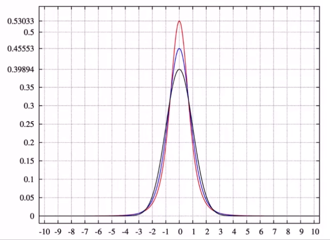

# Percentiles and moments

TODO: link to notebook

## Percentiles

- In a data set, what's the point at which X^ of the values are less than that value?
- Example: income distribution
    - 99% percent of people make less than $506,553
    - 50% of people make less than $42,327

## Moments

- Quantitative measures of the shape of a probability density function
- Mathematically they are a bit hard to wrap your head around:
    - $$ \mu _n = \int^{+\infty}_{-\infty}(x - c)^nf(x)dx $$ (for moment n around value c)
- But intuitively, it's a lot simpler in statistics

---

- The first moment is the mean.
- Second moment is the variance
- Third moment is is "skew" ($\gamma$)
    - How "lopsided" is the distribution?
    - A distribution with a longer tail on the left will be skewed left, and have a negative skew.

- 4th m oment is "kurtosis"
    - How thick is the tail and how sharp is the peak, compared to a normal distribution?
    - Example: higher peaks have higher kurtosis

